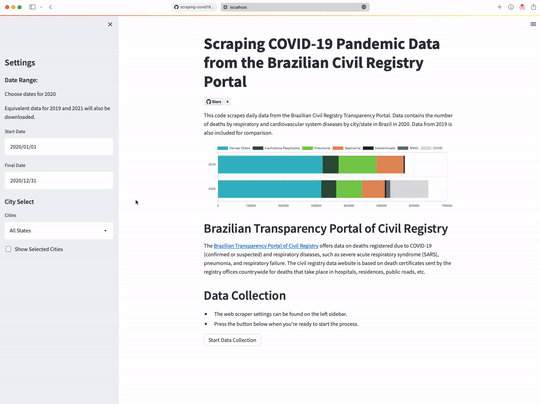

# Scraping COVID-19 Brazil (Outdated)

**This script was used as a tool for a research project during the COVID-19 pandemic in 2020-2021. Therefore, it only retrieves mortality data for those years.** 

 

This application scrapes daily data from the Brazilian Civil Registry Transparency Portal. Data contains the number of deaths by respiratory system diseases by city/state in Brazil in 2020 and 2021. Data from 2019 are also included for comparison.

## Brazilian Transparency Portal of Civil Registry

 The [Brazilian Transparency Portal of Civil Registry](https://transparencia.registrocivil.org.br/especial-covid) offers data on deaths registered due to COVID-19 (confirmed or suspected) and respiratory diseases, such as severe acute respiratory syndrome (SARS), pneumonia, and respiratory failure. The civil registry data website is based on death certificates sent by the registry offices countrywide for deaths that take place in hospitals, residences, public roads, etc [1].
 
 

## Installation

In order to download the files in this repository and install all the required libraries, run the following commands:

1. Clone Repository  (or download the files manually): 

   `git clone https://github.com/andrematte/scraping-covid19-brazil`

2. Install requirements:

    `pip install -r requirements.txt`

## Instructions

In order to setup and execute, the following set of instructions are required:

1. **Fill the required browser headers in the `headers-sample.py` file and rename it to `headers.py`** (config folder). [How to find headers information](https://www.google.com/url?sa=t&rct=j&q=&esrc=s&source=web&cd=&cad=rja&uact=8&ved=2ahUKEwiegpfb2K_vAhU8TDABHcwPC6IQFjABegQIAxAD&url=https%3A%2F%2Fmkyong.com%2Fcomputer-tips%2Fhow-to-view-http-headers-in-google-chrome%2F&usg=AOvVaw22zLfxGCSlZfbutK8-RlTo). You might need to visit the [Brazilian Civil Registry Portal](https://transparencia.registrocivil.org.br/especial-covid) in order to find the needed headers.

2. On the Terminal, navigate to the files directory and run the application by typing `streamlit run scraper-app.py`. This will launch the app **on your browser**.

3. Read the project description and press the Run button at the end. You can also edit the settings on the sidebar (left side). By default, the app will scrape data for all the Brazilian States (2019-2021).

4. The data will be saved in the `data` repository in a directory named after the date the web scraping was executed. The files will be in csv format.

## To-do

- Come up with a solution to generate browser headers in order to improve usability. This can be achieved by using the fakeheaders Python library.
- Fix scripts in order to download data for 2022 and subsequent years.

## License

[MIT License](https://github.com/andrematte/scraping-covid19-brazil/blob/master/LICENSE)

## References
1. Veiga e Silva, L., de Andrade Abi Harb, M. D. P., Teixeira Barbosa dos Santos, A. M., de Mattos Teixeira, C. A., Macedo Gomes, V. H., Silva Cardoso, E. H., Silva da Silva, M., Lankalapalli Vijaykumar, N., Venâncio Carvalho, S., Ponce de Leon Ferreira de Carvalho, A., & Lisboa Frances, C. R. (2020). An analysis of COVID-19 mortality underreporting based on data available from official Brazilian government internet portals (Preprint). Journal of Medical Internet Research, 22, 1–14. https://doi.org/10.2196/21413.
2. Especial COVID-19. Portal da Transparência do Registro Civil. 2020. URL: https://transparencia.registrocivil.org.br/especial-covid. 

